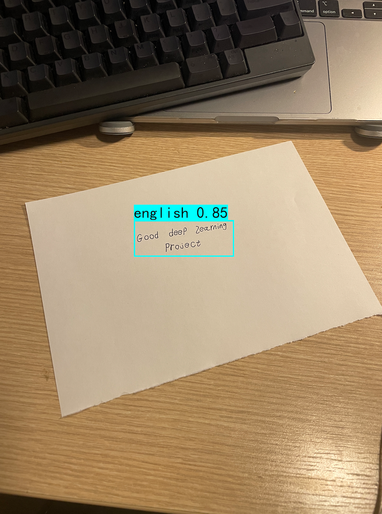

# CASA0018: Image Open Domain QA system via GPT3 API and Cameras

CASA0018 Project - Image Open Domain QA system via GPT3 API and Cameras

The detailed project description can be found in my report (Link wait to be upolad).

> We suggest that students take a fork of this repository so that they can add their own work in progress as they work through the material.

## System Overview

For this project, my multilingual language (Chinese and English) image-to-text open domain QA system with the [ChatGPT-API](https://openai.com/blog/introducing-chatgpt-and-whisper-apis) and [Paddle OCR](https://github.com/PaddlePaddle/PaddleOCR) consists of 3 steps:
 1. Language and text detection: a detection model FRCNN is used to recognize the text from the image and language of that text(Chinese or English) and crop the text from the original image with the language classification results passed into downstream tasks;
 2. Convert zoomed image to text: the previous step results are passed into paddleOCR, and the corresponding language text recognition model is loaded to extract the text from zoomed text image.
 3. QA system: ChatGPT API is used to pass the detected text and return a detailed answer, saved as PDF format and JPG images.


I tried the handwritten text recognition models on the open-source library KerasOCR; it turns out that the KeraOCR cannot recognize handwritten text, and only English language recognition models are supported. This is because KerasOCR is primarily designed to recognize printed text. 

Therefore to allow muti-language handwritten text detections, I have trained two-stage object detection FAST-RCNN models to detect Chinese or English handwriting questions text from images. The dataset connected by myself contains my handwritten text from ChatGPT history questions. The detected text image is cropped, and the language classification results pass into PaddleOCR to load the crossposting text extraction model. After that, the detected texts are used as input to pass into the ChatGPT model through an API connection to return an answer. The program will output intermediate step results and save the final Question&Answer to a pdf file. 

## Experiments Environments
 - OS: Intel(R) Core(TM) i5-8259U@230 GHz Macbook pro 2020
 - Platform: Python 3.10.8, pytorch 1.13.1, tensorflow 2.11.1, paddleocr 2.6.1.0, openai 0.27.2
 - GPU:A100-SXM4-80GB hired on [AutoDL](https://www.autodl.com/home)


## Install requirements
 - ```pip install -r requirements.txt```
 - The pretrained restnet50 backbone model on [VOC dataset](http://host.robots.ox.ac.uk/pascal/VOC/voc2007/) is already downloaded and included in the file.


## Usage and run
The code under the folder System code is already defined and ready to use, where the main.py is the system connected with the camera and QA_results.pdf is the returning pdf results; it will get updated once you run.

To run the program:
```
 cd System\ code/
 python main.py
```

The system will return the intermediate results the results will be similar to following:
 1. For Fast-RCNN text language detection:

  
 