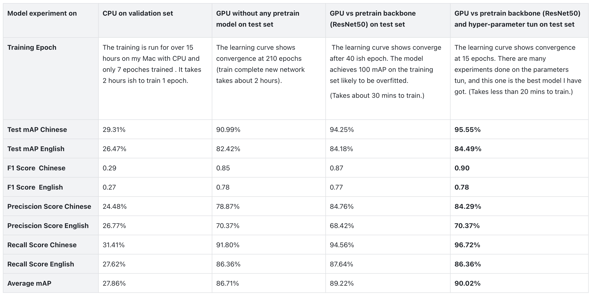

# CASA0018 Project - Image Open Domain QA system via GPT3 API, Cameras and Raspberry Pi 4

Haijin(Allen) Li, https://github.com/Allenpai1/CASA0018-Image-Open-Domain-QA-system-via-GPT3-API-Cameras-and-Raspberry-Pi

## Introduction

ChatGPT is an AI chatbot that was launched in November 2022 by OpenAI. This chatbot is built on OpenAI's GPT-3.5 and GPT-4 large language models, which have been fine-tuned using  both supervised and reinforcement learning techniques. With 175 billion parameters, GPT-3 is among the largest and most powerful AI language processing models. 

In March 2, 2023 the latest version of the GPT-3.5 turbo API was released. The GPT-3.5 Turbo API provides access to the vast knowledge and insights stored in the GPT-3.5 and GPT-4 language models, enabling developers to create more intelligent and sophisticated applications. 

OCR (Optical Character Recognition) is the process of electronically extracting text from images or any documents like PDF and reusing it in various ways, such as full-text searches. Technically, two trained model models are used to perform OCR. The first is the detection model, which is used to detect the text in the image. The second one is the recognition model, which is used to recognize the text in the image. The most used OCR open-source libraries are Keras-OCR, Tesseract(Google), and Paddle-OCR(Baidu).

The objective of this project is to develop a multilingual image-to-text open-domain QA system that is capable of processing both English and Chinese languages. The system will be built by training a new model that can detect hand-written ChatGPT questions and their respective languages, and subsequently forwarding the results to downstream tasks through the [ChatGPT-API](https://openai.com/blog/introducing-chatgpt-and-whisper-apis) and [Paddle OCR](https://github.com/PaddlePaddle/PaddleOCR) pre-trained models. The system's primary function is to provide accurate answers to questions pertaining to the text present in the image.

## System Overview
The system consists of 3 steps:
 1. Language and text detection: a detection model Faster-RCNN is used to recognize the text from the image and language of that text(Chinese or English) and crop the text from the original image with the language classification results passed into downstream tasks;
 2. Convert zoomed image to text: the previous step results are passed into paddleOCR, and the corresponding language text recognition model is loaded to extract the text from zoomed text image;
 3. QA system: ChatGPT API is used to pass the detected text and return a detailed answer, saved as PDF format and JPG images.

Fig 1. Workflow of my Image Open Domain QA system

I tried the handwritten text recognition models on the open-source library KerasOCR; it turns out that the KeraOCR cannot recognize handwritten text, and only English language recognition models are supported. This is because KerasOCR is primarily designed to recognize printed text. 

Therefore to allow muti-language handwritten text detections, I have trained two-stage object detection Faster-RCNN models to detect Chinese or English handwriting questions text from images. The detected text image is cropped, and the language classification results pass into PaddleOCR to load the crossposting text extraction model. After that, the detected texts are used as input to pass into the ChatGPT model through an API connection to return an answer. The program will output intermediate step results and save the final Q&A to a pdf file. 

## Data Used
I have created a dataset that consists of my handwritten responses to ChatGPT history questions. The dataset comprises 464 photos, and 10% of the data has been transformed with rotations ranging from -45 to 45. The dataset has been split into test, train, and validation sets, with proportions of approximately 80%, 10%, and 10% respectively. In total, there are 510 datasets.

Fig 2. Examples of customer dataset  

[Labeling](https://github.com/heartexlabs/labelImg) was utilized to generate .xml files for the creation of ground truth bounding boxes and classifications, which were subsequently transformed into .csv files which made consistent with the [VOC](http://host.robots.ox.ac.uk/pascal/VOC/) dataset format.

Fig 3. Examples of ground truths generation 

The full dataset can be download on [Own dataset](https://drive.google.com/drive/folders/1d7Cq-iJxVMWsWlyYrQ-pGN5UGvLxXnRg?usp=sharing).
## Model trained

### Faster-RCNN

Faster R-CNN is a two-stage object detection algorithm that combines RPN and Fast R-CNN networks. In the first stage, the algorithm generates numerous region proposals, and in the second stage, it classifies these proposals and produces the final bounding box. One of the benefits of Faster R-CNN is its ability to generate a large number of highly accurate and robust region proposals, which sets it apart from one-stage algorithms like YOLO.

Fig 4. Faster-RCNN algorithm aricthrecture 

The model, as depicted in Figure 4, comprises the region proposal network (RPN) and the Fast R-CNN network. The RPN is a fully convolutional network responsible for generating region proposals, whereas the Fast R-CNN network is a standard CNN that classifies the region proposals and performs regression tuning on the bounding box. Notably, the feature map used as input to both the RPN and Fast R-CNN networks is generated by a backbone network such as ResNet or VGG.

The primary reason for selecting a two-stage object detection model is driven by the system requirements. Since the goal is to detect the text in the image, classify its language, and then feed it into PaddleOCR for corresponding language text recognition. Incorrect bounding boxes or classifications could pass erroneous information to downstream tasks, resulting in inaccurate results in the system. Therefore, achieving high accuracy is imperative.

## Environments

### Experiments Environments
 - OS: Intel(R) Core(TM) i5-8259U@230 GHz Macbook pro 2020
 - Raspberry Pi 4B 4GB OS(64-bit)
 - Platform: Python 3.10.8, pytorch 1.13.1, tensorflow 2.11.1, paddleocr 2.6.1.0, openai 0.27.2, OpenCV 4.5.5
 - GPU:A100-SXM4-80GB hired on [AutoDL](https://www.autodl.com/home)
 - IPhone with [IP Camera](https://github.com/shenyaocn/IP-Camera-Bridge) App

### Environment Setup Issues

Table 1. Description of Environment setups 

In Table 1, we can observe the challenges encountered during the OpenCV camera setup and Keras OCR processes, along with the various attempts made to resolve them. Notably, during the experiment of text recognition using Keras OCR, the resulting texts were not ordered properly. This issue can be resolved by implementing the [Pythagorean Theorem approach](https://github.com/shegocodes/keras-ocr) to sort the bounding boxes from top-left to bottom-right.

## Model Training and Evaluation Results

In total, 8 Faster-RCNN detection models were trained, with 1 trained on the CPU and the remaining 7 trained on the A100-SXM4-80GB GPU. Among the GPU-trained models, 1 was trained from scratch, while the others were trained using a loaded Backbone ResNet-50 and different sets of hyperparameters for hyperparameter tuning experiments.

### Model hyperprameter tuning Results

The results of model hyperparameter tuning on the validation set are presented in Table 2. The hyperparameter tuning methods used in this study were based on the [Deep Learning Tuning PlayBook](https://github.com/google-research/tuning_playbook)(Google). The model was trained with recommended initial hyperparameter settings, and the description of the hyperparameter sets can be found in the first column of Table 2. 

It was observed that the model performs better with small anchor sizes and small learning rates on Adam, but a higher learning rate on SGD. This may be due to the nature of the dataset, as most of the training data comprises handwritten text with small bounding boxes. The best model obtained is indicated by bold text in Table 2. row.

Table 2. Faster-RCNN hyperparameter tuning results on validation set 

It is important to note that during the training stage, the model performance is evaluated on the validation dataset after every five updated epoch loops. As a result, the model gains some understanding of the validation set, which is why its performance on the validation set tends to be higher than that on the test set. It should be noted that the test set was only used once to select the final model.

### Detection training Results

The evaluation results for the model on the test set are shown in Table 3. The results reveal that the model trained from scratch performs worse than the one with a ResNet50 Backbone loaded. However, the best model achieved an average mAP of 90.02% after hyperparameter tuning. Additionally, it is advisable to avoid training deep network models like Faster-RCNN, which have over 40 million parameters, on a CPU due to high computational demands.

Table 3. Faster-RCNN main model comparisons on test set 

## Embed model on Raspberry Pi 4

## Dicussion and Conclusion

### Discussion

The system encountered a problem similar to Keras OCR where text recognition was not in order for English language, but it was not the case for Chinese language. This is because in English, we usually have spaces between words, which creates more bounding boxes when detecting the text (see Fig 6.). To address this issue, we could write codes to sort the bounding boxes from top-left to bottom-right using the [Pythagorean Theorem approach](https://github.com/shegocodes/keras-ocr).

Table 6. Paddle OCR detection Results 

### Conclusion

The system performs well overall, particularly the custom-trained model, which can accurately detect text and language in images, including well-printed text, despite the training dataset comprising only hand-written text. This is expected as recognizing hand-written text is generally more challenging than recognizing well-printed text. At present, the system can detect English and Chinese text, but adding more specific language training data and retraining the model can enable it to recognize other languages without difficulty.

------

## Bibliography

1. OpenAI, ChatGPT and Whisper APIs, https://openai.com/blog/introducing-chatgpt-and-whisper-apis
2. Han, K., Xiao, A., Wu, E., Guo, J., Xu, C. and Wang, Y., 2021. Transformer in transformer. Advances in Neural Information Processing Systems, 34, pp.15908-15919.
3. Mithe, R., Indalkar, S. and Divekar, N., 2013. Optical character recognition. International journal of recent technology and engineering (IJRTE), 2(1), pp.72-75.
4. Dale, R., 2021. GPT-3: What’s it good for?. Natural Language Engineering, 27(1), pp.113-118.
5. Girshick, R., 2015. Fast r-cnn. In Proceedings of the IEEE international conference on computer vision (pp. 1440-1448).
6. Du, L., Zhang, R. and Wang, X., 2020, May. Overview of two-stage object detection algorithms. In Journal of Physics: Conference Series (Vol. 1544, No. 1, p. 012033). IOP Publishing.
7. Lu, X., Li, Q., Li, B. and Yan, J., 2020. MimicDet: bridging the gap between one-stage and two-stage object detection. In Computer Vision–ECCV 2020: 16th European Conference, Glasgow, UK, August 23–28, 2020, Proceedings, Part XIV 16 (pp. 541-557). Springer International Publishing.
8. Brownlee, J., 2019. Deep learning for computer vision: image classification, object detection, and face recognition in python. Machine Learning Mastery.
9. bubbliiiiing. (2021). Faster-RCNN Pytorch. Github. https://github.com/bubbliiiing/faster-rcnn-pytorch
10. endernewton. (2021). Faster-RCNN Tensorflow. Github. https://github.com/endernewton/tf-faster-rcnn
11. PaddleOCR. (2022). PaddleOCR. Github. https://github.com/PaddlePaddle/PaddleOCR
12. shegocodes. (2022). Keras-OCR. Github. https://github.com/shegocodes/keras-ocr
13. Google. (2022). Deep Learning Tuning PlayBook. Github. https://github.com/google-research/tuning_playbook

## Declaration of Authorship

I, Haijin Li, confirm that the work presented in this assessment is my own. Material from the work of others not involved in the project has been acknowledged and quotations and paraphrases suitably indicated.

20/04/2022